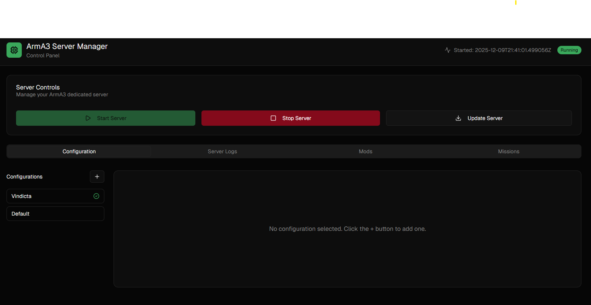
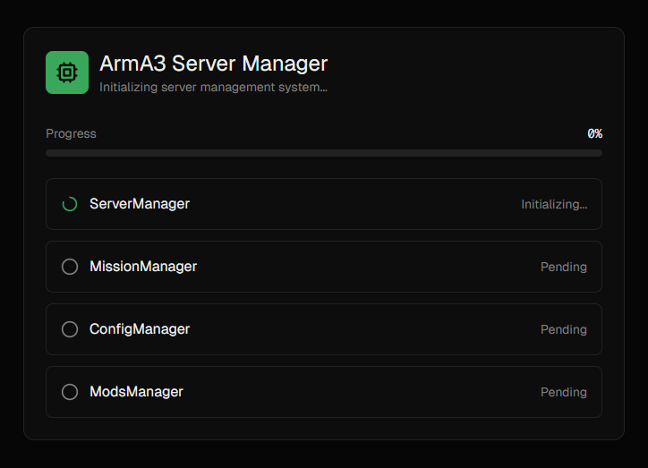
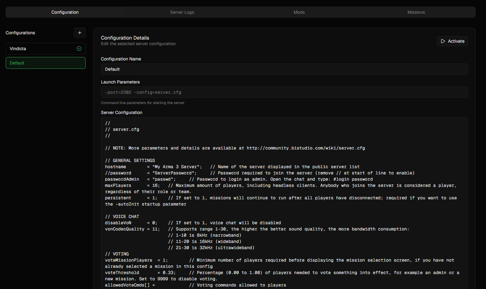
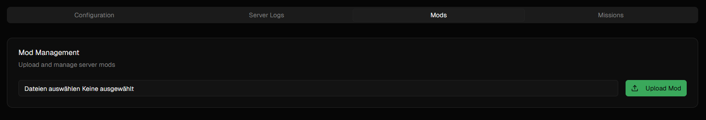
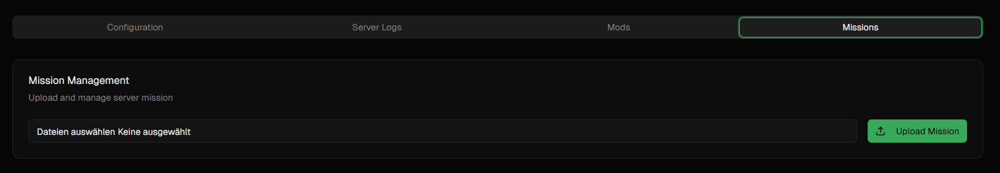
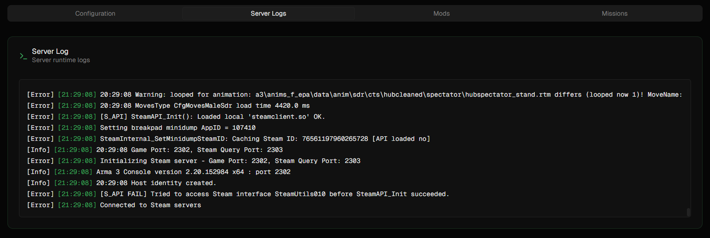
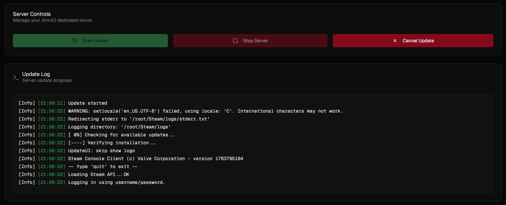

# ArmA 3-Manager
An ArmA 3 dedicated server management interface.

## Features
### Automatic initial setup and download of server and base configuration

When first starting the docker container the server is downloaded and a default configuration is created. Upon restart of the container a check for updates is being run. This is all part of the initialization phase

### Configuration Management

To make switching between configurations easier distinct configurations can be created. These contain the `server.cfg` as well as launch parameters to specify things like mods to load. 
Switching between configurations is done by activating a configuration. This automatically restarts the server with the new settings

### Mods

Currently the best way to upload mods to the server is by creating a zip archive containing the mods directory and using the `Mods` section to upload that archive. It will automatically place the mod in the correct directory. 
For the future I would like to also show already existing mods

### Missions 

Similar to how mods work, mission files can also be uploaded to the server as a Zip archive. 

### Server Logs

To make it easy to see whats happening on the server, a tab showing the last 500 server logs lines is available. It automatically updates and displays the latest logs so its easy to keep open on the side to get a quick update at a glance.

### Server Updates

Even though restarting the docker container automatically updates the server, one might still want to trigger an update manually. When starting the update, the server is stopped and the progress of the update is streamed to the management interface to see exactly whats going on.

## Configuration
The following config keys can be set though environment variables:

- SteamUsername: The username to use for steamcmd
- SteamPassword: The password to use for steamcmd
- SteamCmdPath: The path to the steamcmd script. Pre-defined for docker setup
- ServerDir: The path where the server binaries are placed. Pre-defined for docker setup
- ConfigurationsDir: The path where config packages are placed. Pre-defined for docker setup
- AutoStartServer: [true/false] Default is true. Starts Server after initialization
- SkipInitialization [true/false] Default is false. Skips all initialization steps.

It is advised to specify a steam user and password to use for steamcmd. This will be used for updating the ArmA3 dedicated server. If no credentials are given, anonymous is used. This might not always work correctly. 

## Volumes

By default all relevant files are placed in subdirectories of `/arma3` in the docker image. Creating a volume mount for `/arma3` such as 
```yaml
    volumes:
      - /home/8-prime/arma3:/arma3
```
is all thats needed to persist the server files.

## Roadmap

This is still a very early version. If I find the motivation and time to keep working on this there are some things I would like to improve:

- Display available mods with option to delete
- Enable downloading from workshop through SteamCmd (this is quite annoying because you need an account that owns ArmA 3)
- Show connected players
- Add form based configuration editing with integration for selecting available mods